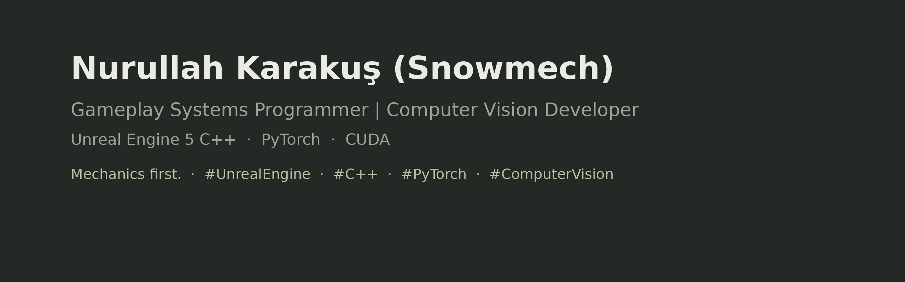

Gameplay systems programmer focused on Unreal Engine 5 C++. 6+ years architecting 
data-driven systems, component-based architectures, and scalable gameplay frameworks. 
Also exploring computer vision with PyTorch—teaching models to understand tree structure 
from field photographs.

## What I Do

I specialize in building scalable, maintainable gameplay systems. My approach: start 
with the mechanic, design the architecture around it, data-drive the tuning. I write 
native C++ for Unreal—keeping Blueprints minimal and deliberate. Backend integration, 
state machines, component hierarchies—structured from first principle.

## Active Projects

**[OP](https://github.com/nurullahkarakus/op-wip)** — Post-apocalyptic survival game. 
Unreal Engine 5 C++. Component-based systems, data-driven crafting and loot, persistent 
player progression.

**[PMAI](https://github.com/nurullahkarakus/pmai-wip)** — Computer vision + ML. 
Segmenting trees (trunk, branches, canopy) from field photos using PyTorch. 
Built a desktop Lab pipeline: annotation → training → testing → error analysis.

## Technical Focus

- **Gameplay Architecture:** Component design, data-driven systems, networking replication
- **Backend Integration:** MySQL, RESTful APIs, persistent player data
- **Computer Vision:** PyTorch, CUDA, image segmentation, dataset pipelines

## Shipped

- **ENKA EnPratik** — E-commerce platform. Flutter + backend integration.
- **More Than Book** — Interactive storytelling app. Unity; mobile optimization.

## Stack

**Engines:** Unreal Engine 5, Unity  
**Languages:** C++, C#, Python  
**Core:** PyTorch · CUDA · MySQL · Git  
**Tools:** Blender, Figma, VS Code

## Links

[LinkedIn](https://www.linkedin.com/in/nurullahkarakus) · [Linktree](https://linktr.ee/snowmech)

---

*Mechanics first.*