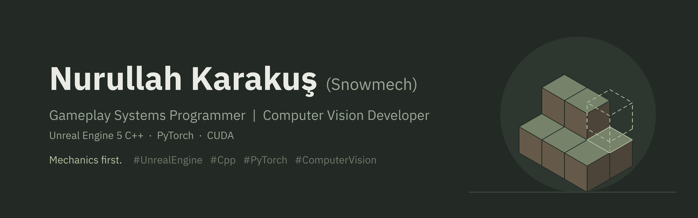
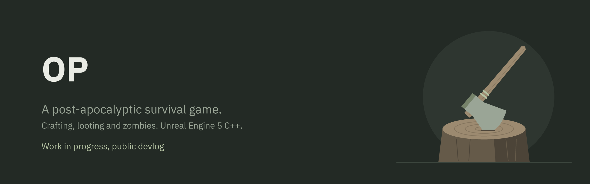

I build gameplay systems in Unreal Engine 5 with C++: mechanics first, then the architecture that keeps them clean and easy to tune. Making games and apps since 2020, independent under Snowmech since 2025. On the side, a computer vision project in PyTorch.

## Now

| [OP](https://github.com/nurullahkarakus/OP-WIP) | [PMAI](https://github.com/nurullahkarakus/PMAI-WIP) |
|---|---|
|  |  |
| Top-down post-apocalyptic survival game. Crafting, looting and zombies. Unreal Engine 5 C++. | Tree segmentation and a desktop Lab to train, test and analyze the models. PyTorch on CUDA. |

## Latest updates

| Date | Project | Update |
|---|---|---|
| Oct 2026 | PMAI | [Devlog 001: Building the Lab](https://github.com/nurullahkarakus/PMAI-WIP/blob/main/devlog/001-building-the-lab.md) |

## Prototypes

**Multiplayer lobby** · Unreal Engine 5 C++ · [Video](https://www.youtube.com/@Snowmechdev)  
A Fortnite-style party lobby. Every player has their own lobby, players can invite each other into a party, and only players who ready up travel to the match map. Built as a portfolio piece and left unfinished.

## How I work

- Gameplay code lives in C++, including UI. Blueprints stay at the edges.
- Systems are built from components with clear ownership.
- Balance and content are tuned through data tables, not code changes.
- Most of my work is survival systems: inventory, equipment, crafting, resources, combat and AI.

## Stack

**Game:** Unreal Engine 5 C++, Unity (C#)  
**Vision:** Python, PyTorch, CUDA, OpenCV, PySide6  
**Backend:** MySQL, .NET, RESTful APIs  
**Tools:** Git, Blender, Figma, MetaHuman, Mixamo

## Contact

Open to new roles and to relocation. LinkedIn is the fastest way to reach me. (Open to relocation)

[LinkedIn](https://www.linkedin.com/in/nurullahkarakus) · [YouTube](https://www.youtube.com/@Snowmechdev) · [snowmech.com](https://snowmech.com) · [Linktree](https://linktr.ee/snowmech)
